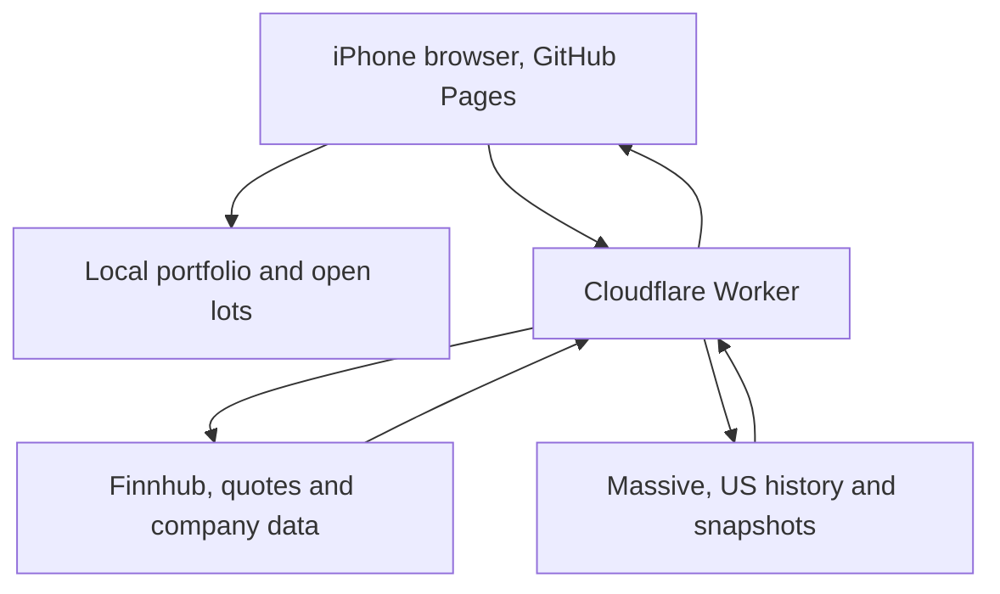

# Northstar Investment Tracker

Northstar is a mobile first, long term investment tracker for a GBP Trading 212 account. It rebuilds holdings from transaction activity, preserves open lots, obtains market data through a private serverless proxy, converts values using current foreign exchange data, and explains every portfolio recommendation.

It is deliberately not a short term trading terminal. There are no fake live badges, no hidden zero values, and no promise that a recommendation will make money.

## What changed

The old single file app has been replaced because its data architecture could not be made reliable by cosmetic patches.

The important changes are:

1. Provider keys no longer enter the browser or local storage.
2. Finnhub and Massive requests run through a Cloudflare Worker.
3. Trading 212 CSV fields are read by exact header name.
4. Lots are matched by exact quantity first, then FIFO. This preserves the intended CRWD result.
5. GBP value is `shares × current native price × current GBP exchange rate`.
6. A missing quote or exchange rate produces an unavailable value, never a zero profit or loss.
7. Provider symbols are mapped explicitly. EQQQ uses `EQQQ.L` on Finnhub and has no Massive US stock mapping.
8. Last known good quotes survive failures. Extreme movements need a second confirming response.
9. Diagnostics distinguish authentication, rate limiting, provider failure, unsupported symbols, market closure and offline state.
10. The recommendation engine separates factual signals from rules based judgement.

## Final architecture



The browser contains holdings, lots, cached market data, diagnostics and public settings. The Worker contains only request logic. Finnhub and Massive keys are encrypted Worker secrets and are never returned to the frontend.

GitHub Pages is static hosting, so it cannot safely hold provider keys. GitHub describes Pages as a service for static HTML, CSS and JavaScript files. Massive also instructs users to keep API keys secure. See [GitHub Pages](https://docs.github.com/en/pages/getting-started-with-github-pages/what-is-github-pages) and the [Massive REST quickstart](https://massive.com/docs/rest/quickstart).

## Local setup

Requirements:

1. Node.js 20 or newer.
2. A Finnhub account and API key.
3. A Massive account and API key.
4. A free Cloudflare account for the Worker.

Run the frontend:

```bash
npm test
npm run serve
```

Open `http://127.0.0.1:4173`.

## Deploy the Cloudflare Worker

From the `worker` directory:

```bash
npm install
cp wrangler.toml.example wrangler.toml
npx wrangler login
npx wrangler secret put FINNHUB_API_KEY
npx wrangler secret put MASSIVE_API_KEY
npx wrangler deploy
```

When prompted for each secret, paste it into Wrangler. Do not place the value in `wrangler.toml`, GitHub Actions, frontend settings or a backup file.

Check `ALLOWED_ORIGIN` in `worker/wrangler.toml`. For this repository it should include:

```toml
ALLOWED_ORIGIN = "https://awaterman78.github.io,http://localhost:4173"
```

Cloudflare returns a URL similar to:

```text
https://northstar-data-proxy.your-subdomain.workers.dev
```

Open Northstar, go to Data, paste that URL into `Cloudflare Worker URL`, then choose `Save and test`.

Cloudflare documents both [Worker secret bindings](https://developers.cloudflare.com/workers/runtime-apis/bindings/) and a [CORS proxy pattern](https://developers.cloudflare.com/workers/examples/cors-header-proxy/).

## Deploy the frontend to GitHub Pages

The correct project address is:

```text
https://awaterman78.github.io/Trading-212/
```

The account root, `https://awaterman78.github.io/`, is a different user site and currently returns a GitHub Pages 404.

To deploy from the repository:

1. Merge the rebuilt branch into `main`.
2. Open the `Trading-212` repository on GitHub.
3. Open Settings, then Pages.
4. Set Source to `Deploy from a branch`.
5. Select `main` and `/(root)`.
6. Save and wait for the Pages deployment to complete.

GitHub's current steps are in [Configuring a publishing source](https://docs.github.com/en/pages/getting-started-with-github-pages/configuring-a-publishing-source-for-your-github-pages-site).

## Using the app

### Fresh start

The app intentionally starts with no holdings. It does not resurrect old God Mode data. If legacy storage is found, it is reported but cannot overwrite the new schema.

### Import Trading 212 activity

1. Export the full account activity CSV from Trading 212.
2. Open Activity in Northstar.
3. Choose the CSV.
4. Check the preview totals and quarantine count.
5. Choose Replace holdings for a complete export, or Add new activity for an incremental export.

Incremental imports are deduplicated by Trading 212 transaction ID, combined with the transactions already stored, then rebuilt chronologically.

### Refresh data

The app uses REST polling as its truthful live mode. A manual refresh also requests history, profiles, fundamentals, analyst recommendations and earnings data. Scheduled polling requests current quotes and foreign exchange data while the app is open.

Massive's unified snapshot is not included on its free Stocks Basic tier. Starter and Developer are documented as 15 minute delayed, while Advanced is real time. Northstar therefore prefers Finnhub for current quotes and uses Massive primarily for historical bars. See [Massive unified snapshots](https://massive.com/docs/rest/stocks/snapshots/unified-snapshot).

Finnhub stock candles are documented as a premium endpoint. Northstar uses Massive history first and reports the actual entitlement failure if the fallback is unavailable. See [Finnhub stock candles](https://finnhub.io/docs/api/stock-candles).

### Read a recommendation

Every recommendation contains:

1. An action, such as Hold, Add, Watch for entry, Review, Trim, Reduce or Exit.
2. A confidence level based on available data.
3. Factual signals for trend, drawdown, volatility, valuation, quality, analysts, earnings proximity and concentration.
4. A rules based judgement explaining why the action was selected.

The recommendation is decision support. It is not regulated financial advice or a guaranteed return.

## Storage and privacy

The only active storage key is:

```text
northstar-investment-tracker
```

Schema version is currently `1`.

Backups contain portfolio data and public settings. They never contain Finnhub or Massive secrets. The app includes separate controls to reset holdings, reset provider settings, or reset everything.

If the active storage value is corrupted, Northstar quarantines the raw value under a timestamped key and starts safely with an empty portfolio.

## Tests

Run:

```bash
npm test
```

The same core checks can be run inside the app under Data, Test centre.

See [TEST_REPORT.md](./TEST_REPORT.md) for the verified results and [LIMITATIONS.md](./LIMITATIONS.md) for what remains genuinely outside the current version.
